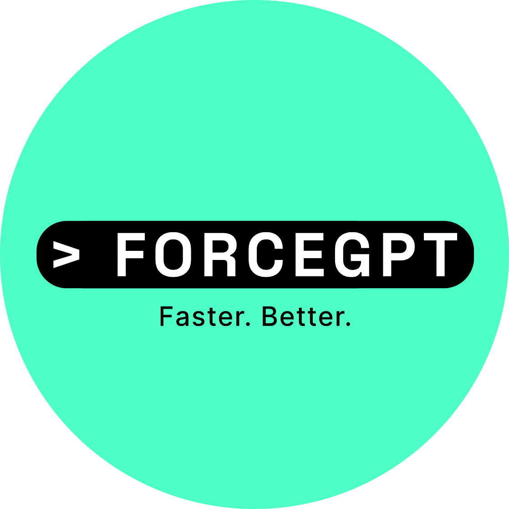

<h1>Welcome to the ForceGPT extension</h1>

<h3>We are so excited to have you here!</h3>

Get ready to change the way you code for *Salesforce* 🤖💻🚀

First off, you need a **ForceGPT account** to get an **API key**. Once you have signed up, just set your credentials with the **Signup** command button.